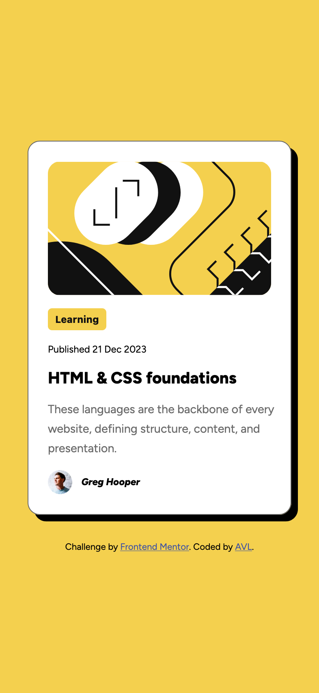
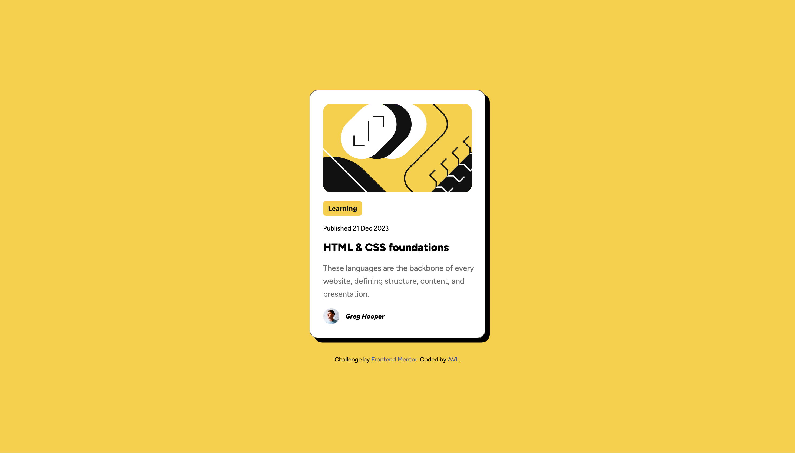

# Frontend Mentor - Blog preview card component solution

This is a solution to the [Blog preview card component challenge on Frontend Mentor](https://www.frontendmentor.io/challenges/blog-preview-card-ckPaj01IcS). Frontend Mentor challenges help you improve your coding skills by building realistic projects.

## Table of contents

- [The challenge](#the-challenge)
- [Screenshot](#screenshot)
- [Links](#links)
- [My process](#my-process)
- [Built with](#built-with)
- [What I learned](#what-i-learned)
- [Continued development](#continued-development)
- [Useful resources](#useful-resources)
- [AI Collaboration](#ai-collaboration)
- [Author](#author)

## Overview

This project is a solution to the Frontend Mentor Blog Preview Card challenge. The goal was to build a responsive blog preview card that matched the designs provided.

### The challenge

Users should be able to:

- View the optimal layout depending on their device's screen size
- See hover and focus states for interactive elements

### Screenshot

### Links

- Github URL: https://github.com/arielvonlestat/BlogPreviewCard

- Live Site URL: https://arielvonlestat.github.io/BlogPreviewCard/

## My process

With all transparency, I am going back and writing this after improving everything. I did not fully understand what the README files were for when I originally did the challenge. However, after going back with a fresh set of eyes and new knowledge I decided to do it!

I started with looking at the CSS. I got rid of any redundancies that were unneeded, which was actually a lot. I continued to clean up any of the code that seemed inefficent. This included things like changing multiple padding to a single padding and setting up a direct :root system for keeping colors organized.

In the original challenge I was supposed to create a hover status state of which I completely missed I needed to do, so I added that. I also had orginally chosen to use the Transform property to make my card the size that it needed to be. I have since learned that this is not the best way to go because it is not responsive. Once I took that away it created issues with the size and shape of the card itself. I then began to work on these issues one by one. Correcting the main content within the Blog Card.

I then updated the HTML semantics & corrected the CSS where needed. I had inappropriately used elements like "Address" and "Header" along with a "Div" that could have been more descriptive. I changed these to "Figure" "h1" & "Main" respectively.

Finally, I had chosen a button for the "Learning" portion of the card but because it was not an actual button, I changed it to a "Span" instead and then made it look like a button within CSS.

### Built with

- Semantic HTML5 markup
- CSS custom properties
- Flexbox
- Mobile-first workflow
- VS-Code

### What I learned

This was my lowest graded challenge that i've recieved. I did not realize at the time why that was but as I dug into it I realized immediately why it was. I was still really learning how to propertly do Semantic HTML & how it relates to accessibility & how the browser reads the information. I realized I used inaproppriate elements for many things (as stated above). I learned how to pay closer attention to this and to look at it as if i've never seen the code before and try to understand what it is supposed to be. This really helped me come up with what HTML elements I should use instead of what I had.

I also didn't fully understand Flexbox and so I used it many times within the CSS where I thoguht it was making a difference. Now that I know more about how it works and functions as a whole I was able to take out the redundancies.

One of the biggest things I learned was how I didn't need the "Button" element to make my "Learning" portion into a button. I could do all of that with style and didn't need the defaults to do it for me. I do not believe I fully comprehended it when I origianlly did the challenge, as I do now.

I also learned and cemented how "Commit Messages" work. I was always confused by this within the ratings on Frontend Mentor. However, with some Googling and some trail and error, I know feel confident that I understand it. I also learned how to use Git Hub more efficently withing VS Code so that I did not have to keep making modifications in Git Hub itself but used my Source Control withing VS Code to push updates onto Git Hub. MUCH MUCH BETTER! A way cleaner way to process commits as well!

Overall, it's very clear that I have learned a lot since first doing this challenge.

### Continued development

I think at this point I am ready to move on to learning javascript. I am by no means an expert at CSS but I feel a lot more confident in my skills now. I will continue to go back through my old challenges and improve them. I will possibly continue with Frontend Mentor's challenges until I reach one with Javascript and then stop to dig into that.

### Useful resources

- [ChatGPT](https://www.chatgpt.com) - As much as i'd like to not admit it sometimes, it has been a huge resource for me. It has enabled me to talk things out directly as if I am doing so with a teacher. That being said, I am very careful in how I use it. I asked very direct, specific questions and only ask about overal concepts not how to directly do things. I have found this to be very successful. I gain enough information to understand and then accomplish the task on my own.

- [VS Code](https://code.visualstudio.com/) - I didn't fully appreciate or realize how well this code editor works. I simply had it because that's what my original Udemy instructor recommended. I didn't realize you could link it to Git Hub and push everything to it, like updated files and of course your commits. Highly recommend it, if you arent using it already!

### AI Collaboration

- What tools did you use (e.g., ChatGPT, Claude, GitHub Copilot)?

As mentioned above I used ChatGPT.

- How did you use them (e.g., debugging, generating boilerplate, brainstorming solutions)?

I am always very careful in the way that I use it. I do not want it doing the work for me and therefore I only ask it specific questions to understand better. Typically overall concepts, or generalized ideas. I am careful not to ask it to just completely do something for me as I do not feel like I learn that way. If it does give me more information than I want (which it has from time to time) then I spend a lot of time understanding why the answer or concept works and if it doesn't explain it in a way I can understand I asked questions to make sure I understand it.

- What worked well? What didn't?

It is great as an overall teacher when I have a specific question or a concept that I need to learn. However I have also caught it to be wrong on more than a few occasions which i've been proud of my abilities to realize that it was wrong but it is certainly something to be mindful of.

## Author

- Frontend Mentor - [ArielVonLestat](https://www.frontendmentor.io/profile/arielvonlestat)
